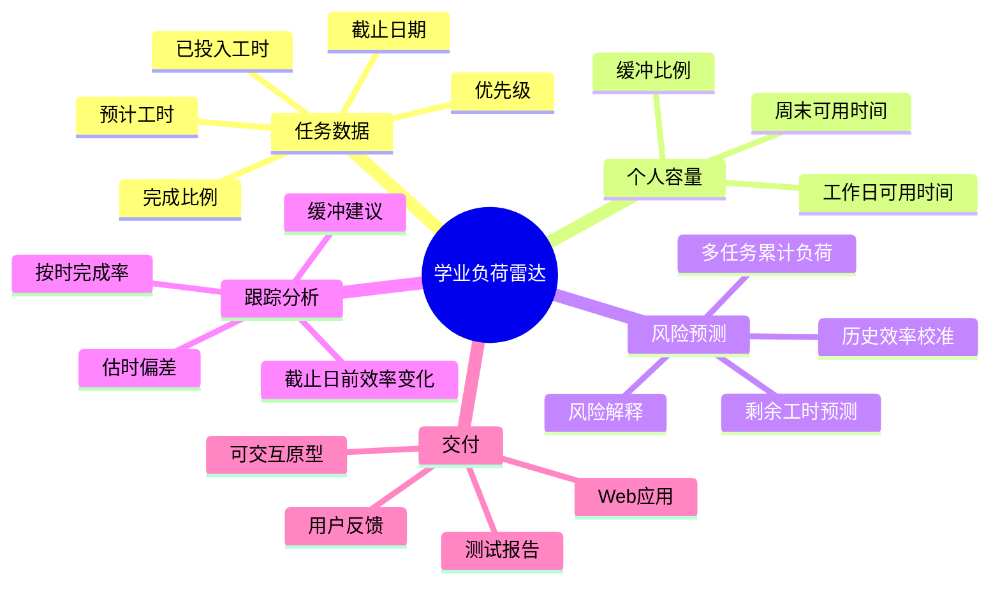

# 学业负荷雷达项目立项

## 项目概述

学业负荷雷达面向同时承担多门课程、实验、报告和小组项目的大学生。系统记录任务截止日期、预计工时、当前进度、已投入时间以及个人每天可用时间，预测任务剩余工时，并从全部任务的累计负荷出发判断截止日期风险。

当前项目已经形成可运行的 Web 原型，后续按照课程任务书继续补齐需求、原型、进度计划、设计、测试、发布和真实用户反馈材料。

## 立项会议记录

- 日期：2026 年 9 月 21 日
- 会议形式：项目启动讨论
- 讨论主题：大学生在多任务并行情况下如何判断哪些任务真正存在延期风险
- 角色分工建议：产品与需求、前端与交互、后端与算法、测试与文档
- 待补充证据：实际参会成员姓名、会议地点、会议照片和 Gitee 项目主页

## 头脑风暴候选方向

| 候选方向 | 核心问题 | 可实现性 | 差异化 | 结论 |
| --- | --- | --- | --- | --- |
| 普通课程待办清单 | 记录任务和截止日期 | 高 | 低 | 功能过于常见，不选 |
| 成绩目标计算器 | 根据平时成绩预测期末要求 | 高 | 中 | 数据来源有限，不选 |
| 自习时间计划器 | 把任务分配到每天 | 中 | 中 | 可作为后续功能 |
| 学业负荷雷达 | 结合剩余工时、全部任务和可用容量预测风险 | 高 | 高 | 确定为项目方向 |

## 思维导图

## NABCD 分析

### Need 需求

学生通常能看到每个作业的截止日期，却难以判断多个任务共享同一段时间时是否还能按时完成。普通待办工具只显示日期和优先级，不会结合任务工作量、个人可用时间、历史效率和此前必须完成的任务进行判断。用户需要一个能够解释“为什么来不及”以及“需要预留多少时间”的工具。

### Approach 做法

系统采用可解释的规则模型。用户录入任务、截止日期、预计工时、进度和已投入时间，并设置每天可用学习时间。系统使用历史任务的实际工时与预计工时比值校准剩余工时，再按照截止日期累计所有未完成任务的负荷，与缓冲后的累计可用时间比较，给出高、中、低风险和文字解释。

### Benefit 好处

- 发现多个任务叠加造成的隐性超载。
- 根据实际进度不断修正任务剩余时间。
- 通过历史记录认识个人估时偏差。
- 用清晰的数值和原因辅助重新安排任务，而不是只依赖主观焦虑。

### Competitors 竞争

Todoist、滴答清单等产品擅长任务记录、提醒和日历管理，但通常不会针对学生场景计算“截止日前累计剩余工时与个人容量”的关系。项目不追求替代完整待办软件，而是聚焦可解释的学业负荷分析和个人效率校准。

### Delivery 推广

先在课程小组和同班学生中试用，通过公开 Web 地址提供访问。项目主页提供截图、功能说明、示例数据、使用步骤和反馈入口。根据试用记录改进字段设计、风险解释和剩余时间预测。

## 第一阶段范围

### 纳入范围

- 新建、删除和完成任务。
- 导入历史任务和进行中任务。
- 记录预计工时、实际工时、已投入工时和完成比例。
- 基于历史效率预测剩余工时。
- 基于全部任务的累计负荷判断截止日期风险。
- 批量处理已经录入的全部任务并输出组合风险摘要。
- 跟踪按时率、估时偏差和缓冲比例建议。

### 暂不纳入范围

- 自动读取学校教务系统数据。
- 使用大模型判断任务难度。
- 自动发送第三方通知。
- 多用户账号、组织权限和跨设备同步。

## 立项材料检查

- [x] 项目方向和问题定义
- [x] 头脑风暴候选方案
- [x] 思维导图
- [x] NABCD 模型
- [ ] 实际参会成员、角色和时间确认
- [ ] 会议照片
- [ ] Gitee 仓库与 Wiki 地址
