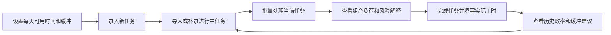

# 学业负荷雷达原型设计

## 原型目标

原型验证用户能否完成一条完整流程：录入任务和个人容量，查看多任务组合风险，补录历史任务，更新进行中任务信息，并根据统计结果理解个人估时偏差和缓冲比例。

## 当前原型

- 形式：可运行 Web 原型
- 本地地址：`http://127.0.0.1:8000`
- 启动方式：在项目目录运行 `python -m app.main`
- 公开地址：`待部署后填写真实 HTTPS 地址，并在提交前人工打开验证`
- 健康检查：`<公开地址>/api/health` 应返回 `{"status":"ok"}`

## 核心交互流程

## 页面区域

| 区域 | 主要输入 | 主要输出 | 当前状态 |
| --- | --- | --- | --- |
| 总览指标 | 无 | 任务数、剩余工时、高风险和中风险数量 | 已实现 |
| 新建任务 | 名称、课程、截止日期、预计工时、优先级 | 新任务 | 已实现 |
| 任务风险 | 已录入任务 | 本任务剩余、组合剩余、组合可用、风险解释 | 已实现 |
| 批量处理 | 已填写的全部任务 | 风险分布、最早超载日期、最高风险任务 | 已实现 |
| 个人容量 | 工作日、周末时间、缓冲比例 | 可用容量参数 | 已实现 |
| 进行中任务 | 进度、已投入工时、开始时间 | 剩余时间预测 | 已实现 |
| 历史任务 | 预计与实际工时、完成时间 | 个人效率样本 | 已实现 |
| 近期表现 | 历史完成数据 | 按时率、估时偏差、截止日前效率、缓冲建议 | 已实现 |

## 原型验收场景

1. 导入示例历史任务，系统能够生成历史效率系数。
2. 导入示例进行中任务，任务进入风险面板。
3. 点击“批量处理当前任务”，系统同时处理全部已填写任务。
4. 截止日期较晚的任务会计入此前所有任务的剩余工时。
5. 完成任务时记录实际工时，近期表现随之更新。

## 后续原型改进

- 增加任务编辑和进度更新界面。
- 增加按日期展示的容量时间线。
- 增加任务依赖和冲突说明。
- 增加导入预览、重复检测和错误定位。
- 部署公开访问地址并补充首页、任务录入、风险分析和完成跟踪截图。
- 在 Wiki 中记录 GitHub 仓库地址、公开地址、部署日期和健康检查结果。
