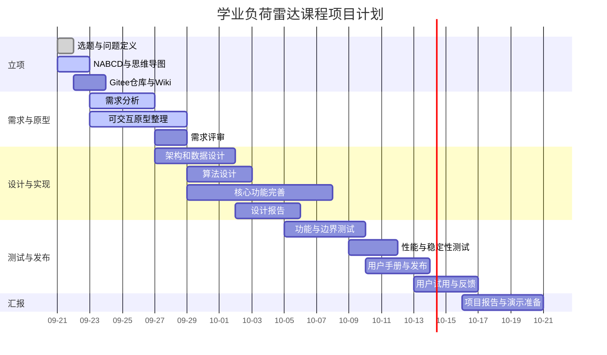

# 学业负荷雷达进度计划

## 计划说明

任务书要求功能分解不少于 30 项，并将任务分配到个人。当前计划将工作拆分为 36 项，按四类角色各分配 9 项。组队确定后，应把角色名称替换为真实成员姓名，并在 Gitee Issue 或项目看板中持续更新状态。

角色定义：A 为产品与需求，B 为前端与交互，C 为后端与算法，D 为测试、文档与发布。

## 任务分解

| 编号 | 阶段 | 任务 | 负责人 | 计划日期 | 交付证据 | 状态 |
| --- | --- | --- | --- | --- | --- | --- |
| T01 | 立项 | 汇总候选选题并比较 | A | 09-21 | 头脑风暴表 | 已完成 |
| T02 | 立项 | 定义核心用户痛点 | A | 09-21 | 问题定义 | 已完成 |
| T03 | 立项 | 完成 NABCD 分析 | A | 09-21 | NABCD 文档 | 已完成初稿 |
| T04 | 立项 | 整理会议成员和角色 | D | 09-22 | 会议记录 | 待补充 |
| T05 | 立项 | 绘制并导出思维导图 | B | 09-22 | 思维导图图片 | 进行中 |
| T06 | 立项 | 建立 Gitee 仓库与 Wiki | D | 09-22 | 仓库地址 | 未开始 |
| T07 | 需求 | 识别用户与利益相关者 | A | 09-23 | 用户分析 | 已完成初稿 |
| T08 | 需求 | 编写功能需求清单 | A | 09-23 | FR 清单 | 已完成初稿 |
| T09 | 需求 | 编写非功能需求 | A | 09-24 | NFR 清单 | 已完成初稿 |
| T10 | 需求 | 编写用例和验收标准 | A | 09-24 | 用例表 | 已完成初稿 |
| T11 | 需求 | 评审需求范围和边界 | D | 09-25 | 评审记录 | 未开始 |
| T12 | 需求 | 定稿需求分析报告 | D | 09-26 | DOCX 报告 | 进行中 |
| T13 | 原型 | 梳理完整用户流程 | B | 09-23 | 流程图 | 已完成初稿 |
| T14 | 原型 | 完成任务录入界面 | B | 09-24 | 页面截图 | 已完成 |
| T15 | 原型 | 完成风险面板界面 | B | 09-25 | 页面截图 | 已完成 |
| T16 | 原型 | 完成历史与进行中任务界面 | B | 09-26 | 页面截图 | 已完成 |
| T17 | 原型 | 完成批量处理结果区域 | B | 09-27 | 页面截图 | 已完成 |
| T18 | 原型 | 进行可用性走查并修订 | B | 09-28 | 走查记录 | 未开始 |
| T19 | 设计 | 设计系统模块架构 | C | 09-27 | 架构图 | 进行中 |
| T20 | 设计 | 设计任务数据结构 | C | 09-28 | 数据字典 | 进行中 |
| T21 | 设计 | 设计历史效率算法 | C | 09-29 | 算法说明 | 已完成初版 |
| T22 | 设计 | 设计剩余工时预测算法 | C | 09-30 | 算法说明 | 已完成初版 |
| T23 | 设计 | 设计多任务累计风险算法 | C | 10-01 | 算法说明 | 已完成初版 |
| T24 | 设计 | 编写概要和详细设计报告 | D | 10-03 | 设计报告 | 未开始 |
| T25 | 实现 | 完成任务 CRUD 接口 | C | 09-29 | API 与测试 | 已完成 |
| T26 | 实现 | 完成历史任务导入 | C | 09-30 | API 与示例 CSV | 已完成 |
| T27 | 实现 | 完成进行中任务录入 | C | 10-01 | API 与示例 CSV | 已完成 |
| T28 | 实现 | 完成组合风险批量处理 | C | 10-02 | API 与测试 | 已完成 |
| T29 | 实现 | 增加任务编辑和进度更新 | B | 10-04 | 可操作页面 | 未开始 |
| T30 | 实现 | 增加日期容量时间线 | B | 10-06 | 时间线页面 | 未开始 |
| T31 | 测试 | 编写功能测试计划 | D | 10-05 | 测试计划 | 未开始 |
| T32 | 测试 | 补充接口和边界测试 | D | 10-07 | 自动化测试 | 进行中 |
| T33 | 测试 | 执行性能与稳定性测试 | D | 10-09 | `docs/自动化测试记录.md` | 已完成核心性能基准，待补稳定性故障用例 |
| T34 | 发布 | 编写用户使用说明 | A | 10-10 | 用户手册 | 未开始 |
| T35 | 发布 | 部署公开网站并制作介绍页 | D | 10-12 | 公开地址 | 未开始 |
| T36 | 反馈 | 组织试用并分析用户反馈 | A | 10-16 | 反馈分析 | 未开始 |

## 甘特图

## 里程碑

| 里程碑 | 完成标准 | 计划日期 |
| --- | --- | --- |
| M1 项目立项 | Wiki 包含会议记录、思维导图和 NABCD | 2026-09-23 |
| M2 需求基线 | 需求报告完成评审并形成版本号 | 2026-09-27 |
| M3 原型基线 | 完整交互流程可演示 | 2026-09-29 |
| M4 设计基线 | 架构、数据和算法设计报告完成 | 2026-10-05 |
| M5 功能冻结 | 核心功能完成并通过功能测试 | 2026-10-09 |
| M6 公开发布 | 公网可访问且有用户说明 | 2026-10-13 |
| M7 反馈闭环 | 完成用户反馈分析和最终修订 | 2026-10-17 |
